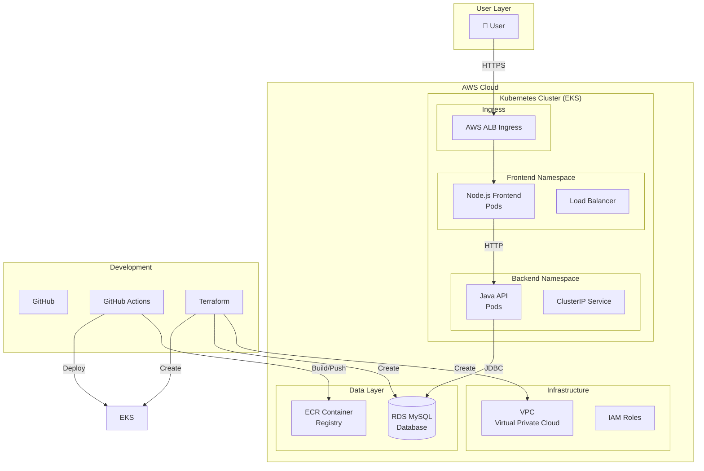
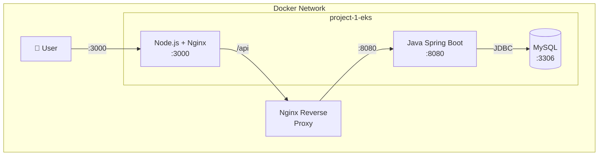
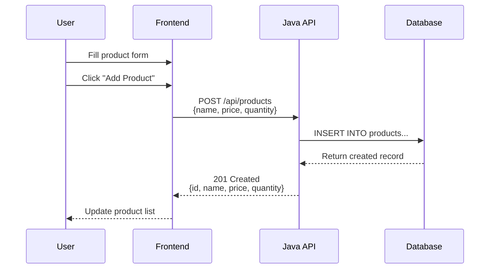
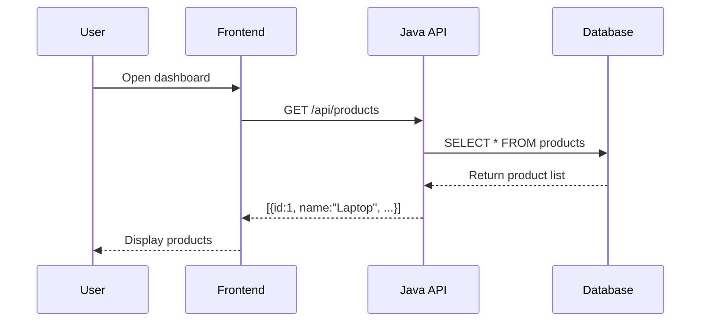

# 01 - Project Overview & Architecture

## 📖 Table of Contents
1. [What is this Project?](#what-is-this-project)
2. [System Architecture](#system-architecture)
3. [Component Breakdown](#component-breakdown)
4. [Technology Stack](#technology-stack)
5. [Data Flow](#data-flow)

---

## What is this Project?

This is a **multi-tier microservices application** deployed on **AWS EKS (Elastic Kubernetes Service)**. It's designed to demonstrate modern DevOps practices and cloud-native development skills for your resume.

### What You'll Learn

By building and deploying this project, you'll gain hands-on experience with:

| Skill | Technology |
|-------|------------|
| Backend Development | Java Spring Boot |
| Frontend Development | React + Vite |
| Database | MySQL (RDS) |
| Containerization | Docker |
| Orchestration | Kubernetes (EKS) |
| Infrastructure as Code | Terraform |
| CI/CD | GitHub Actions |
| Cloud Platform | AWS |

---

## System Architecture

### High-Level Architecture Diagram



### Local Development Architecture

When running locally with Docker Compose:



---

## Component Breakdown

### 1. Frontend (Node.js + React + Nginx)

```
┌─────────────────────────────────────────┐
│           Node.js + React               │
│                                         │
│  ┌─────────────────────────────────┐   │
│  │     Product Dashboard UI        │   │
│  │  - Product List                 │   │
│  │  - Add Product Form             │   │
│  │  - Delete Product               │   │
│  │  - Status Indicator            │   │
│  └─────────────────────────────────┘   │
│                   │                     │
│                   ▼                     │
│  ┌─────────────────────────────────┐   │
│  │     Axios (HTTP Client)        │   │
│  └─────────────────────────────────┘   │
│                   │                     │
│                   ▼                     │
│  ┌─────────────────────────────────┐   │
│  │    Nginx (Reverse Proxy)       │   │
│  │    Port 80                     │   │
│  └─────────────────────────────────┘   │
└─────────────────────────────────────────┘
```

**Purpose**: User interface for managing products

**Key Features**:
- Real-time product listing
- Add/delete products
- API health status indicator
- Responsive design

### 2. Backend (Java Spring Boot)

```
┌─────────────────────────────────────────┐
│         Java Spring Boot API            │
│                                         │
│  ┌─────────────────────────────────┐   │
│  │    REST Controller Layer        │   │
│  │  GET  /api/products            │   │
│  │  POST /api/products            │   │
│  │  PUT  /api/products/{id}      │   │
│  │  DELETE /api/products/{id}    │   │
│  └─────────────────────────────────┘   │
│                   │                     │
│                   ▼                     │
│  ┌─────────────────────────────────┐   │
│  │     Service Layer              │   │
│  │  Business Logic                │   │
│  └─────────────────────────────────┘   │
│                   │                     │
│                   ▼                     │
│  ┌─────────────────────────────────┐   │
│  │     Repository Layer (JPA)     │   │
│  │  Database Operations           │   │
│  └─────────────────────────────────┘   │
│                   │                     │
│                   ▼                     │
│  ┌─────────────────────────────────┐   │
│  │     Hibernate ORM              │   │
│  └─────────────────────────────────┘   │
│                   │                     │
│                   ▼                     │
│  ┌─────────────────────────────────┐   │
│  │     MySQL Database             │   │
│  └─────────────────────────────────┘   │
└─────────────────────────────────────────┘
```

**Purpose**: REST API for product CRUD operations

**Endpoints**:
- `GET /api/products` - List all products
- `GET /api/products/{id}` - Get single product
- `POST /api/products` - Create product
- `PUT /api/products/{id}` - Update product
- `DELETE /api/products/{id}` - Delete product

### 3. Database (MySQL)

```
┌─────────────────────────────────────────┐
│            MySQL Database               │
│                                         │
│  Table: products                       │
│  ┌─────────────────────────────────┐   │
│  │ id       │ INT (PK, AUTO)      │   │
│  │ name     │ VARCHAR(255)         │   │
│  │ descrip. │ TEXT                 │   │
│  │ price    │ DECIMAL(10,2)        │   │
│  │ quantity │ INT                  │   │
│  └─────────────────────────────────┘   │
│                                         │
│  Connection Pool: HikariCP              │
│  Max Connections: 10                   │
└─────────────────────────────────────────┘
```

---

## Technology Stack

### Frontend Layer

| Technology | Version | Purpose |
|------------|---------|---------|
| React | 18.2 | UI Framework |
| Vite | 5.0 | Build Tool |
| Axios | 1.6 | HTTP Client |
| Nginx | 1.29 | Reverse Proxy |

### Backend Layer

| Technology | Version | Purpose |
|------------|---------|---------|
| Java | 17 | Programming Language |
| Spring Boot | 3.2 | Framework |
| Spring Data JPA | - | ORM |
| MySQL Connector | 8.1 | Database Driver |
| Hibernate | 6.3 | ORM Implementation |

### DevOps Layer

| Technology | Purpose |
|------------|---------|
| Docker | Containerization |
| Kubernetes | Orchestration |
| Terraform | Infrastructure as Code |
| GitHub Actions | CI/CD Pipeline |
| AWS EKS | Managed Kubernetes |
| AWS RDS | Managed Database |
| AWS ECR | Container Registry |

---

## Data Flow

### Creating a Product (Step by Step)



### Viewing Products (Step by Step)



---

## Project File Structure

```
project-1-eks/
├── java-api/
│   ├── src/main/java/com/example/api/
│   │   ├── ApiApplication.java       # Main class
│   │   ├── controller/
│   │   │   └── ProductController.java # REST endpoints
│   │   ├── model/
│   │   │   └── Product.java          # Entity class
│   │   └── repository/
│   │       └── ProductRepository.java # Database operations
│   ├── src/main/resources/
│   │   └── application.properties    # Configuration
│   ├── Dockerfile                    # Container image
│   └── pom.xml                       # Maven config
│
├── node-frontend/
│   ├── src/
│   │   ├── App.jsx                  # Main component
│   │   ├── App.css                   # Styles
│   │   └── main.jsx                  # Entry point
│   ├── index.html
│   ├── vite.config.js               # Vite config
│   ├── nginx.conf                   # Nginx config
│   └── Dockerfile                   # Container image
│
├── terraform/
│   ├── main.tf                      # Providers
│   ├── variables.tf                  # Variables
│   ├── vpc.tf                       # VPC setup
│   ├── eks.tf                       # EKS cluster
│   ├── rds.tf                       # Database
│   └── ecr.tf                       # Container registry
│
├── k8s/
│   ├── namespace.yaml                # Kubernetes namespace
│   ├── secrets.yaml                 # Secrets
│   ├── java-api/deployment.yaml     # API deployment
│   ├── node-frontend/deployment.yaml# Frontend deployment
│   └── ingress.yaml                 # Ingress routing
│
└── .github/workflows/
    └── ci-cd.yaml                   # GitHub Actions
```

---

## Learning Objectives

After completing this project, you will understand:

1. ✅ How to build a REST API with Java Spring Boot
2. ✅ How to create a React frontend
3. ✅ How to containerize applications with Docker
4. ✅ How to orchestrate containers with Kubernetes
5. ✅ How to manage infrastructure with Terraform
6. ✅ How to automate deployments with CI/CD
7. ✅ How to deploy to AWS cloud

---

## Next Steps

Ready to dive deeper? Check out these guides:

- **[02-Concepts](./02-concepts.md)** - Learn the core DevOps concepts
- **[03-Java-API](./03-java-api.md)** - Build the Spring Boot API
- **[06-Docker](./06-docker.md)** - Master containerization
