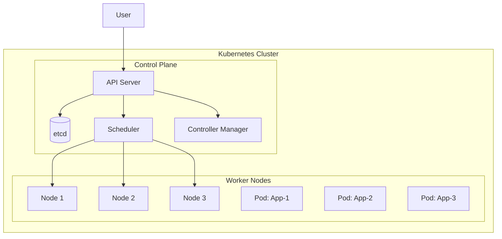

# 02 - Core DevOps Concepts Explained

## 📖 Table of Contents
1. [Microservices](#microservices)
2. [Containerization](#containerization)
3. [Kubernetes & Orchestration](#kubernetes--orchestration)
4. [Infrastructure as Code (IaC)](#infrastructure-as-code-iac)
5. [CI/CD Pipelines](#cicd-pipelines)
6. [Cloud Computing](#cloud-computing)
7. [AWS Services Overview](#aws-services-overview)

---

## Microservices

### What is a Microservice?

Imagine a **restaurant** vs a **food truck**:

| Monolithic (Restaurant) | Microservices (Food Court) |
|-------------------------|---------------------------|
| Everything in one building | Each vendor has their own stall |
| One kitchen makes all food | Each stall makes their specialty |
| If kitchen fails, nothing works | If one stall fails, others still work |
| Hard to add new dishes | Easy to add new vendors |

### Why Microservices?

```
┌─────────────────────────────────────────────────────────┐
│                   MONOLITHIC                            │
│  ┌─────────────────────────────────────────────────┐   │
│  │  UI + Business Logic + Database                 │   │
│  │  - Single codebase                              │   │
│  │  - All components tightly coupled              │   │
│  │  - One technology stack                        │   │
│  │  - Difficult to scale                          │   │
│  │  - One failure takes down entire app           │   │
│  └─────────────────────────────────────────────────┘   │
└─────────────────────────────────────────────────────────┘

┌─────────────────────────────────────────────────────────┐
│                   MICROSERVICES                         │
│                                                         │
│   ┌──────────┐   ┌──────────┐   ┌──────────┐         │
│   │ Frontend │   │  API     │   │Database  │         │
│   │ Service  │   │ Service  │   │ Service  │         │
│   └────┬─────┘   └────┬─────┘   └────┬─────┘         │
│        │              │              │                 │
│        └──────────────┼──────────────┘                 │
│                       │                                │
│              ┌────────▼────────┐                       │
│              │   API Gateway   │                       │
│              └─────────────────┘                       │
│                                                         │
│  - Independent services                                │
│  - Different technology stacks possible               │
│  - Easy to scale individual services                  │
│  - Failure isolation                                   │
└─────────────────────────────────────────────────────────┘
```

### Key Benefits

1. **Independent Deployment** - Update one service without affecting others
2. **Technology Flexibility** - Use different languages for different services
3. **Scalability** - Scale only the services that need more resources
4. **Fault Isolation** - One service failing doesn't crash the entire app
5. **Team Autonomy** - Different teams can work on different services

---

## Containerization

### What is a Container?

A container is like a **shipping container** for software:

```
┌─────────────────────────────────────────────────────────┐
│                    PHYSICAL SERVER                      │
│                                                         │
│   ┌─────────────┐  ┌─────────────┐  ┌─────────────┐   │
│   │  Container  │  │  Container  │  │  Container  │   │
│   │  (Your App) │  │  (Your App) │  │  (Your App) │   │
│   │             │  │             │  │             │   │
│   │  ┌───────┐ │  │  ┌───────┐ │  │  ┌───────┐ │   │
│   │  │ Code  │ │  │  │ Code  │ │  │  │ Code  │ │   │
│   │  │+Deps  │ │  │  │+Deps  │ │  │  │+Deps  │ │   │
│   │  └───────┘ │  │  └───────┘ │  │  └───────┘ │   │
│   └─────────────┘  └─────────────┘  └─────────────┘   │
│                                                         │
│   ┌─────────────────────────────────────────────────┐   │
│   │              Docker Engine                       │   │
│   │         (Operating System for Containers)        │   │
│   └─────────────────────────────────────────────────┘   │
│                                                         │
└─────────────────────────────────────────────────────────┘
```

### Why Containers?

| Virtual Machines | Containers |
|-----------------|------------|
| Heavy (full OS) | Light (just code + deps) |
| Minutes to start | Seconds to start |
| GB in size | MB in size |
| Isolated at hardware level | Isolated at process level |

### Docker Basics

```bash
# Build an image from a Dockerfile
docker build -t myapp .

# Run a container from an image
docker run -p 8080:8080 myapp

# List running containers
docker ps

# Stop a container
docker stop container_id

# View logs
docker logs container_id
```

### Docker vs Virtual Machines

```
┌─────────────────────────────────────────────────────────────┐
│                    VIRTUAL MACHINE                          │
│  ┌─────────────────────────────────────────────────────┐   │
│  │                    Guest OS                          │   │
│  │   ┌────────────────────────────────────────────┐    │   │
│  │   │              Application                   │    │   │
│  │   │     Code + Libraries + Dependencies        │    │   │
│  │   └────────────────────────────────────────────┘    │   │
│  └─────────────────────────────────────────────────────┘   │
│                    Hypervisor                               │
│                 (VMware, Hyper-V)                          │
└─────────────────────────────────────────────────────────────┘

┌─────────────────────────────────────────────────────────────┐
│                      CONTAINER                              │
│  ┌─────────────────────────────────────────────────────┐   │
│  │              Application                             │   │
│  │     Code + Libraries + Dependencies                │   │
│  └─────────────────────────────────────────────────────┘   │
│                    Docker Engine                            │
│                 (Shared Host OS)                           │
└─────────────────────────────────────────────────────────────┘
```

---

## Kubernetes & Orchestration

### What is Kubernetes?

Kubernetes (K8s) is an **orchestration platform** - think of it as a **traffic controller** for containers:

```
┌─────────────────────────────────────────────────────────────┐
│                  WITHOUT ORCHESTRATION                      │
│                                                             │
│   You manually:                                            │
│   - Start containers on servers                            │
│   - Handle failures yourself                                │
│   - Scale manually                                         │
│   - Manage networking                                      │
│   - Handle updates                                         │
│                                                             │
└─────────────────────────────────────────────────────────────┘

┌─────────────────────────────────────────────────────────────┐
│                  WITH KUBERNETES                            │
│                                                             │
│   Kubernetes automatically:                                 │
│   ┌─────────────────────────────────────────────────────┐  │
│   │  📊 Scheduler    │  Start containers on best server │  │
│   │  🔄 Self-Healing │  Restart failed containers       │  │
│   │  📈 Scaling      │  Add/remove containers as needed │  │
│   │  🌐 Networking   │  Route traffic to │
│   │ containers     │   🔄 Updates     │  Rolling updates without downtime│  │
│   │  🔒 Security    │  Manage access and permissions    │  │
│   └─────────────────────────────────────────────────────┘  │
└─────────────────────────────────────────────────────────────┘
```

### Kubernetes Architecture



### Key Kubernetes Concepts

| Concept | Description | Analogy |
|---------|-------------|---------|
| **Pod** | Smallest deployable unit (1+ containers) | A shipping crate |
| **Service** | Network abstraction for pods | Load balancer |
| **Deployment** | Manages pod replicas | Blueprint |
| **ReplicaSet** | Ensures desired number of pods | Health inspector |
| **Ingress** | External access to services | Front door |
| **Namespace** | Logical isolation | Apartments |

### How Kubernetes Manages Your App

```
┌─────────────────────────────────────────────────────────────┐
│                   DEPLOYMENT                                │
│                                                             │
│  desired: 3 replicas                                        │
│                                                             │
│  ┌─────────────────────────────────────────────────────┐   │
│  │                 ReplicaSet                           │   │
│  │                                                     │   │
│  │   ┌─────────┐   ┌─────────┐   ┌─────────┐         │   │
│  │   │  Pod 1  │   │  Pod 2  │   │  Pod 3  │         │   │
│  │   │ ◉ ◉ ◉   │   │ ◉ ◉ ◉   │   │ ◉ ◉ ◉   │         │   │
│  │   └─────────┘   └─────────┘   └─────────┘         │   │
│  │                                                     │   │
│  └─────────────────────────────────────────────────────┘   │
│                                                             │
│  If Pod 2 crashes → ReplicaSet starts new one             │
│                                                             │
└─────────────────────────────────────────────────────────────┘
```

---

## Infrastructure as Code (IaC)

### What is IaC?

Infrastructure as Code means **managing your infrastructure using code** instead of manual clicks:

```
┌─────────────────────────────────────────────────────────────┐
│                    MANUAL (OLD WAY)                        │
│                                                             │
│  1. Click in AWS Console to create VPC                    │
│  2. Click to create Subnets                               │
│  3. Click to create Security Groups                       │
│  4. Click to create EKS Cluster                           │
│  5. Click to create RDS Database                          │
│                                                             │
│  Problems:                                                 │
│  ❌ Not reproducible                                       │
│  ❌ Hard to track changes                                  │
│  ❌ Difficult to replicate                                 │
│  ❌ Human errors                                           │
└─────────────────────────────────────────────────────────────┘

┌─────────────────────────────────────────────────────────────┐
│                    INFRASTRUCTURE AS CODE                   │
│                                                             │
│  Write terraform main.tf:                                  │
│  ┌─────────────────────────────────────────────────────┐   │
│  │  module "vpc" {                                      │   │
│  │    source = "terraform-aws-modules/vpc/aws"         │   │
│  │    cidr = "10.0.0.0/16"                             │   │
│  │  }                                                  │   │
│  │                                                     │   │
│  │  module "eks" {                                      │   │
│  │    source = "terraform-aws-modules/eks/aws"        │   │
│  │    cluster_name = "my-app"                         │   │
│  │  }                                                  │   │
│  └─────────────────────────────────────────────────────┘   │
│                                                             │
│  Run: terraform apply                                      │
│                                                             │
│  Benefits:                                                 │
│  ✅ Reproducible                                           │
│  ✅ Version controlled                                     │
│  ✅ Documented                                             │
│  ✅ Automated                                              │
└─────────────────────────────────────────────────────────────┘
```

### Terraform Workflow

```
┌─────────────────────────────────────────────────────────────┐
│                   TERRAFORM WORKFLOW                        │
│                                                             │
│  ┌─────────┐                                               │
│  │  Write  │  Create .tf files with infrastructure        │
│  │   Code  │  definitions                                   │
│  └────┬────┘                                               │
│       │                                                    │
│       ▼                                                    │
│  ┌─────────┐                                               │
│  │  Init   │  terraform init                               │
│  │         │  Download providers & modules                  │
│  └────┬────┘                                               │
│       │                                                    │
│       ▼                                                    │
│  ┌─────────┐                                               │
│  │  Plan   │  terraform plan                               │
│  │         │  Preview what will be created                  │
│  └────┬────┘                                               │
│       │                                                    │
│       ▼                                                    │
│  ┌─────────┐                                               │
│  │ Apply   │  terraform apply                             │
│  │         │  Create/update infrastructure                 │
│  └────┬────┘                                               │
│       │                                                    │
│       ▼                                                    │
│  ┌─────────┐                                               │
│  │ State   │  Store in terraform.tfstate                   │
│  │         │  Track what exists                            │
│  └─────────┘                                               │
│                                                             │
└─────────────────────────────────────────────────────────────┘
```

---

## CI/CD Pipelines

### What is CI/CD?

**CI (Continuous Integration)**: Automatically test code when you push
**CD (Continuous Deployment)**: Automatically deploy when tests pass

```
┌─────────────────────────────────────────────────────────────┐
│                    CI/CD PIPELINE                           │
│                                                             │
│  ┌─────────┐    ┌─────────┐    ┌─────────┐    ┌─────────┐ │
│  │  Code   │───▶│  Build  │───▶│  Test   │───▶│ Deploy  │ │
│  │  Push   │    │         │    │         │    │         │ │
│  └─────────┘    └─────────┘    └─────────┘    └─────────┘ │
│                                                             │
│  GitHub Actions Workflow:                                   │
│  ┌─────────────────────────────────────────────────────┐   │
│  │  on: push                                           │   │
│  │    branches: [main]                                │   │
│  │                                                     │   │
│  │  jobs:                                             │   │
│  │    build:                                          │   │
│  │      runs-on: ubuntu-latest                        │   │
│  │      steps:                                        │   │
│  │        - uses: actions/checkout@v4                │   │
│  │        - run: mvn clean package                    │   │
│  │        - run: docker build ./java-api              │   │
│  └─────────────────────────────────────────────────────┘   │
│                                                             │
└─────────────────────────────────────────────────────────────┘
```

### Pipeline Stages Explained

| Stage | What Happens | Why It Matters |
|-------|-------------|----------------|
| **Checkout** | Get code from Git | Start the process |
| **Build** | Compile code, bundle assets | Create deployable artifact |
| **Test** | Run automated tests | Catch bugs early |
| **Security Scan** | Check for vulnerabilities | Prevent security issues |
| **Build Image** | Create Docker image | Package the application |
| **Push Image** | Upload to registry | Make it available |
| **Deploy** | Update Kubernetes | Make it live |

---

## Cloud Computing

### What is the Cloud?

Think of cloud computing like **electricity**:

| Traditional Servers | Cloud Computing |
|-------------------|-----------------|
| Buy your own generator | Pay for what you use |
| Maintain yourself | Provider maintains |
| Capacity planning needed | Scale on demand |
| Upfront cost | Pay-as-you-go |
| You own everything | Provider owns infrastructure |

### Cloud Service Models

```
┌─────────────────────────────────────────────────────────────┐
│                    ON-PREMISES                             │
│  You own: Servers, Storage, Network, Security               │
│  You manage: Everything                                    │
└─────────────────────────────────────────────────────────────┘
        │
        ▼
┌─────────────────────────────────────────────────────────────┐
│                    IaaS                                    │
│  Provider: Servers, Storage, Network                        │
│  You: Operating systems, runtime, data                      │
│  Examples: AWS EC2, Google Compute Engine                  │
└─────────────────────────────────────────────────────────────┘
        │
        ▼
┌─────────────────────────────────────────────────────────────┐
│                    PaaS                                    │
│  Provider: Servers, Storage, Network, OS, Runtime           │
│  You: Application, Data                                    │
│  Examples: Heroku, AWS Elastic Beanstalk                    │
└─────────────────────────────────────────────────────────────┘
        │
        ▼
┌─────────────────────────────────────────────────────────────┐
│                    SaaS                                    │
│  Provider: Everything                                       │
│  You: Just use it                                          │
│  Examples: Gmail, Slack, Salesforce                        │
└─────────────────────────────────────────────────────────────┘
```

---

## AWS Services Overview

### Services Used in This Project

| Service | Purpose | In Our Project |
|---------|---------|---------------|
| **EC2** | Virtual servers | EKS worker nodes |
| **EKS** | Managed Kubernetes | Container orchestration |
| **RDS** | Managed database | MySQL database |
| **ECR** | Container registry | Store Docker images |
| **VPC** | Virtual network | Network isolation |
| **IAM** | Access management | Security roles |
| **ALB** | Load balancing | Route traffic |

### AWS Global Infrastructure

```
┌─────────────────────────────────────────────────────────────┐
│                     AWS GLOBAL                             │
│                                                             │
│  ┌─────────────────────────────────────────────────────┐   │
│  │                    REGIONS                          │   │
│  │   us-east-1 │ eu-west-1 │ ap-southeast-1 │ ...    │   │
│  └─────────────────────────────────────────────────────┘   │
│                                                             │
│  ┌─────────────────────────────────────────────────────┐   │
│  │                  AVAILABILITY ZONES                  │   │
│  │   us-east-1a │ us-east-1b │ us-east-1c            │   │
│  │   (Data centers in same region, physically separate)│   │
│  └─────────────────────────────────────────────────────┘   │
│                                                             │
└─────────────────────────────────────────────────────────────┘
```

---

## Summary

### What We Learned

1. **Microservices** - Breaking apps into smaller, independent services
2. **Containers** - Lightweight, portable software packages
3. **Kubernetes** - Orchestrating and managing containers at scale
4. **IaC** - Managing infrastructure with code
5. **CI/CD** - Automating testing and deployment
6. **Cloud** - On-demand computing resources

### How These Connect

```
┌─────────────────────────────────────────────────────────────┐
│                    DEVELOPMENT                             │
│                                                             │
│   Write Code ──▶ GitHub ──▶ CI Pipeline                    │
│       │                                      │              │
│       │                                      ▼              │
│       │                              ┌──────────────┐       │
│       │                              │   Build &    │       │
│       │                              │    Test      │       │
│       │                              └──────┬───────┘       │
│       │                                     │                │
│       │                                     ▼                │
│       │                              ┌──────────────┐       │
│       │                              │  Docker      │       │
│       │                              │  Images      │       │
│       │                              └──────┬───────┘       │
│       │                                     │                │
└───────┼─────────────────────────────────────┼────────────────┘
        │                                     │
        ▼                                     ▼
┌─────────────────────────────────────────────────────────────┐
│                    DEPLOYMENT                              │
│                                                             │
│   ┌──────────────┐    ┌──────────────┐                     │
│   │   Terraform  │───▶│  AWS (EKS)   │                     │
│   │   (IaC)     │    │              │                     │
│   └──────────────┘    └──────┬───────┘                     │
│                              │                              │
│                              ▼                              │
│                       ┌──────────────┐                     │
│                       │ Kubernetes   │                     │
│                       │ (Orchestrate)│                     │
│                       └──────────────┘                     │
│                                                             │
└─────────────────────────────────────────────────────────────┘
```

---

## Next Steps

Now that you understand the concepts, let's build:

- **[03-Java-API](./03-java-api.md)** - Build the Spring Boot backend
- **[04-React-Frontend](./04-react-frontend.md)** - Create the React UI
- **[06-Docker](./06-docker.md)** - Deep dive into containers
- **[07-Kubernetes](./07-kubernetes.md)** - Learn K8s deployment
