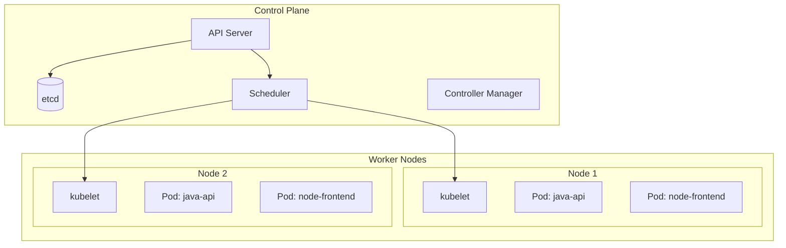
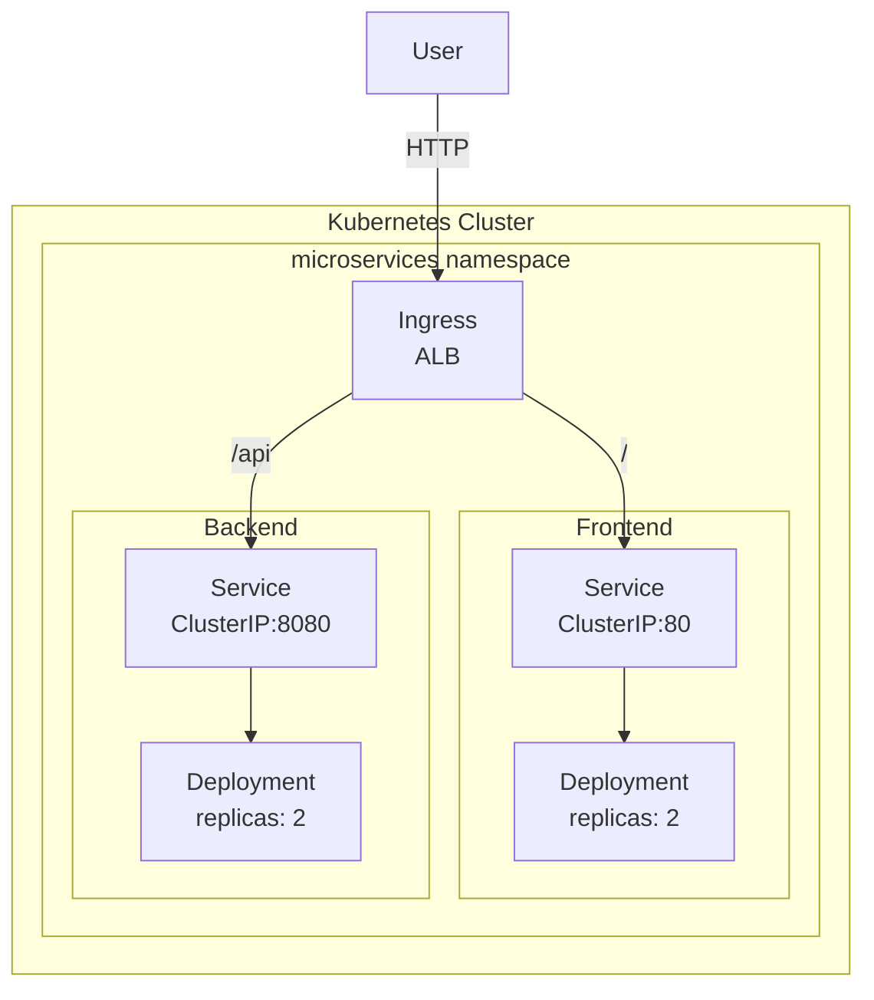

# 07 - Kubernetes & EKS Tutorial

## Table of Contents
1. [What is Kubernetes?](#what-is-kubernetes)
2. [Kubernetes Architecture](#kubernetes-architecture)
3. [Key Concepts](#key-concepts)
4. [Kubernetes Objects](#kubernetes-objects)
5. [Our K8s Manifests](#our-k8s-manifests)
6. [Deploying to EKS](#deploying-to-eks)

---

## What is Kubernetes?

Kubernetes (K8s) is an **orchestration platform** for containers. It automates deployment, scaling, and management of containerized applications.

```
┌─────────────────────────────────────────────────────────────────┐
│                 KUBERNETES PURPOSE                               │
│                                                                  │
│   Without Kubernetes:                                           │
│   ┌─────────────────────────────────────────────────────────┐   │
│   │ You manually:                                            │   │
│   │ - Decide which server to run each container             │   │
│   │ - Monitor if containers are running                     │   │
│   │ - Restart failed containers                             │   │
│   │ - Scale up/down based on traffic                        │   │
│   │ - Handle updates without downtime                       │   │
│   └─────────────────────────────────────────────────────────┘   │
│                                                                  │
│   With Kubernetes:                                              │
│   ┌─────────────────────────────────────────────────────────┐   │
│   │ Kubernetes automatically:                               │   │
│   │ ✓ Schedules containers on best nodes                    │   │
│   │ ✓ Monitors health & restarts failed containers          │   │
│   │ ✓ Scales based on metrics                               │   │
│   │ ✓ Rolling updates with zero downtime                   │   │
│   │ ✓ Load balances traffic                                 │   │
│   └─────────────────────────────────────────────────────────┘   │
│                                                                  │
└─────────────────────────────────────────────────────────────────┘
```

---

## Kubernetes Architecture

### Cluster Architecture



### Components Explained

| Component | Description |
|-----------|-------------|
| **API Server** | The brain - handles all API requests |
| **etcd** | Database that stores cluster state |
| **Scheduler** | Decides where to place pods |
| **Controller Manager** | Ensures desired state |
| **kubelet** | Agent running on each node |
| **kube-proxy** | Handles networking |

---

## Key Concepts

### Pod

A Pod is the smallest deployable unit - one or more containers that share storage/network:

```yaml
apiVersion: v1
kind: Pod
metadata:
  name: java-api
spec:
  containers:
    - name: java-api
      image: java-api:latest
      ports:
        - containerPort: 8080
```

### Deployment

A Deployment manages ReplicaSets (multiple Pods):

```yaml
apiVersion: apps/v1
kind: Deployment
metadata:
  name: java-api
spec:
  replicas: 3
  selector:
    matchLabels:
      app: java-api
  template:
    metadata:
      labels:
        app: java-api
    spec:
      containers:
        - name: java-api
          image: java-api:latest
```

### Service

A Service provides network abstraction for Pods:

```yaml
apiVersion: v1
kind: Service
metadata:
  name: java-api
spec:
  type: ClusterIP
  ports:
    - port: 8080
      targetPort: 8080
  selector:
    app: java-api
```

### Service Types

| Type | Description | Use Case |
|------|-------------|----------|
| ClusterIP | Internal only | Backend services |
| NodePort | Exposes on each node | Development |
| LoadBalancer | External LB | Production |
| Ingress | HTTP/HTTPS routing | Web traffic |

---

## Kubernetes Objects

### Our Architecture



---

## Our K8s Manifests

### Namespace

```yaml
apiVersion: v1
kind: Namespace
metadata:
  name: microservices
```

### Java API Deployment

```yaml
apiVersion: apps/v1
kind: Deployment
metadata:
  name: java-api
  namespace: microservices
spec:
  replicas: 2
  selector:
    matchLabels:
      app: java-api
  template:
    metadata:
      labels:
        app: java-api
    spec:
      containers:
        - name: java-api
          image: 123456789012.dkr.ecr.us-east-1.amazonaws.com/java-api:latest
          ports:
            - containerPort: 8080
          env:
            - name: DB_URL
              valueFrom:
                secretKeyRef:
                  name: db-credentials
                  key: DB_URL
          resources:
            requests:
              memory: "512Mi"
              cpu: "250m"
            limits:
              memory: "1Gi"
              cpu: "500m"
          livenessProbe:
            httpGet:
              path: /api/products/health
              port: 8080
            initialDelaySeconds: 60
          readinessProbe:
            httpGet:
              path: /api/products/health
              port: 8080
            initialDelaySeconds: 30
```

### Java API Service

```yaml
apiVersion: v1
kind: Service
metadata:
  name: java-api
  namespace: microservices
spec:
  type: ClusterIP
  ports:
    - port: 8080
      targetPort: 8080
  selector:
    app: java-api
```

### Secrets

```yaml
apiVersion: v1
kind: Secret
metadata:
  name: db-credentials
  namespace: microservices
type: Opaque
stringData:
  DB_URL: jdbc:mysql://rds-endpoint:3306/productsdb
  DB_USERNAME: admin
  DB_PASSWORD: your-password
```

### Ingress

```yaml
apiVersion: networking.k8s.io/v1
kind: Ingress
metadata:
  name: microservices-ingress
  namespace: microservices
  annotations:
    kubernetes.io/ingress.class: nginx
spec:
  rules:
    - http:
        paths:
          - path: /api
            pathType: Prefix
            backend:
              service:
                name: java-api
                port:
                  number: 8080
          - path: /
            pathType: Prefix
            backend:
              service:
                name: node-frontend
                port:
                  number: 80
```

---

## Deploying to EKS

### Step 1: Configure kubectl

```bash
# Update kubeconfig
aws eks update-kubeconfig --name eks-microservices --region us-east-1

# Verify connection
kubectl cluster-info
kubectl get nodes
```

### Step 2: Apply Manifests

```bash
# Apply all manifests
kubectl apply -f k8s/namespace.yaml
kubectl apply -f k8s/secrets.yaml
kubectl apply -f k8s/java-api/deployment.yaml
kubectl apply -f k8s/node-frontend/deployment.yaml
kubectl apply -f k8s/ingress.yaml

# Or apply all at once
kubectl apply -f k8s/
```

### Step 3: Verify Deployment

```bash
# Check pods
kubectl get pods -n microservices

# Check services
kubectl get svc -n microservices

# Check ingress
kubectl get ingress -n microservices

# View logs
kubectl logs -n microservices -l app=java-api
```

### Step 4: Debugging

```bash
# Describe pod for details
kubectl describe pod java-api-xxxxx -n microservices

# Stream logs
kubectl logs -f java-api-xxxxx -n microservices

# Execute into container
kubectl exec -it java-api-xxxxx -n microservices -- sh
```

---

## Summary

### Key kubectl Commands

```bash
# Get resources
kubectl get pods
kubectl get svc
kubectl get ingress
kubectl get nodes

# Apply changes
kubectl apply -f deployment.yaml

# Delete resources
kubectl delete -f deployment.yaml

# Scale deployment
kubectl scale deployment java-api --replicas=5

# Rolling restart
kubectl rollout restart deployment/java-api

# Check rollout status
kubectl rollout status deployment/java-api
```

### Key Concepts

1. **Pod** - Smallest deployable unit
2. **Deployment** - Manages pod replicas
3. **Service** - Network abstraction
4. **Ingress** - HTTP routing
5. **Secret** - Sensitive data
6. **Namespace** - Isolation

---

## Next Steps

- [08-Terraform](./08-terraform.md) - Provision EKS cluster
- [09-GitHub-Actions](./09-github-actions.md) - CI/CD to K8s
