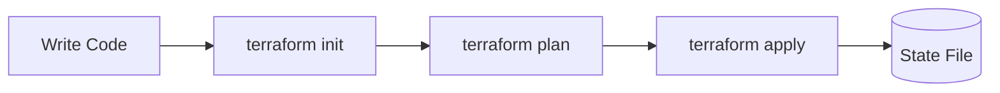

# 08 - Terraform Tutorial

## Table of Contents
1. [What is Terraform?](#what-is-terraform)
2. [Terraform Basics](#terraform-basics)
3. [Our Terraform Files](#our-terraform-files)
4. [AWS Resources](#aws-resources)
5. [Deployment](#deployment)

---

## What is Terraform?

Terraform is an **Infrastructure as Code (IaC)** tool. It lets you define cloud infrastructure using code.

```
┌─────────────────────────────────────────────────────────────────┐
│                    TERRAFORM PURPOSE                             │
│                                                                  │
│   Before Terraform:                                             │
│   ┌─────────────────────────────────────────────────────────┐   │
│   │ Click in AWS Console:                                   │   │
│   │ 1. Create VPC                                           │   │
│   │ 2. Create Subnets                                        │   │
│   │ 3. Create Security Groups                               │   │
│   │ 4. Create EKS Cluster                                   │   │
│   │ 5. Create Node Groups                                    │   │
│   │ 6. Create RDS Database                                  │   │
│   │ 7. Create ECR Repositories                             │   │
│   └─────────────────────────────────────────────────────────┘   │
│                                                                  │
│   With Terraform:                                               │
│   ┌─────────────────────────────────────────────────────────┐   │
│   │ terraform apply                                          │   │
│   │ Creates everything automatically                         │   │
│   └─────────────────────────────────────────────────────────┘   │
│                                                                  │
└─────────────────────────────────────────────────────────────────┘
```

---

## Terraform Basics

### The Workflow



### Key Commands

```bash
# Initialize (download providers)
terraform init

# Preview changes
terraform plan

# Apply changes
terraform apply

# Apply with auto-approve
terraform apply -auto-approve

# Destroy all resources
terraform destroy

# Format code
terraform fmt

# Validate syntax
terraform validate
```

---

## Our Terraform Files

### Directory Structure

```
terraform/
├── main.tf         # Provider configuration
├── variables.tf   # Input variables
├── vpc.tf         # Virtual Private Cloud
├── eks.tf         # EKS Cluster
├── rds.tf         # Database
└── ecr.tf         # Container Registry
```

### main.tf - Provider Setup

```terraform
terraform {
  required_version = ">= 1.6"
  
  required_providers {
    aws = {
      source  = "hashicorp/aws"
      version = "~> 5.0"
    }
  }
}

provider "aws" {
  region = var.aws_region
  
  default_tags {
    tags = {
      Project     = "eks-microservices"
      Environment = var.environment
      ManagedBy   = "Terraform"
    }
  }
}
```

### variables.tf

```terraform
variable "aws_region" {
  description = "AWS region"
  type        = string
  default     = "us-east-1"
}

variable "cluster_name" {
  description = "EKS cluster name"
  type        = string
  default     = "eks-microservices"
}

variable "node_instance_type" {
  description = "EC2 instance type"
  type        = string
  default     = "t3.medium"
}
```

---

## AWS Resources

### VPC - Virtual Private Cloud

```terraform
module "vpc" {
  source  = "terraform-aws-modules/vpc/aws"
  version = "~> 5.0"

  name = "${var.cluster_name}-vpc"
  cidr = "10.0.0.0/16"

  azs             = ["us-east-1a", "us-east-1b", "us-east-1c"]
  private_subnets = ["10.0.1.0/24", "10.0.2.0/24", "10.0.3.0/24"]
  public_subnets  = ["10.0.101.0/24", "10.0.102.0/24", "10.0.103.0/24"]

  enable_nat_gateway   = true
  single_nat_gateway   = false
  enable_dns_hostnames = true
}
```

### EKS Cluster

```terraform
module "eks" {
  source  = "terraform-aws-modules/eks/aws"
  version = "~> 19.0"

  cluster_name    = var.cluster_name
  cluster_version = "1.29"

  vpc_id                         = module.vpc.vpc_id
  subnet_ids                     = module.vpc.private_subnets
  cluster_endpoint_public_access = true

  eks_managed_node_groups = {
    primary = {
      name           = "${var.cluster_name}-node-group"
      instance_types = [var.node_instance_type]
      min_size       = 1
      max_size       = 4
      desired_size   = 2
    }
  }
}
```

### RDS Database

```terraform
module "rds" {
  source  = "terraform-aws-modules/rds/aws"
  version = "~> 6.0"

  identifier = "${var.cluster_name}-mysql"

  engine               = "mysql"
  engine_version       = "8.0"
  instance_class       = "db.t3.micro"
  allocated_storage    = 20

  db_name  = "productsdb"
  username = "admin"
  password = var.db_password

  vpc_security_group_ids = [aws_security_group.rds.id]
  subnet_ids             = module.vpc.private_subnets

  multi_az = false
}
```

### ECR - Container Registry

```terraform
resource "aws_ecr_repository" "java_api" {
  name = "java-api"
  
  image_scanning_configuration {
    scan_on_push = true
  }
}

resource "aws_ecr_repository" "node_frontend" {
  name = "node-frontend"
  
  image_scanning_configuration {
    scan_on_push = true
  }
}
```

---

## Deployment

### Step 1: Configure AWS

```bash
# Configure AWS CLI
aws configure

# Or set environment variables
export AWS_ACCESS_KEY_ID="your-key"
export AWS_SECRET_ACCESS_KEY="your-secret"
```

### Step 2: Initialize Terraform

```bash
cd terraform
terraform init
```

### Step 3: Plan Deployment

```bash
terraform plan -out=tfplan
```

### Step 4: Apply

```bash
terraform apply tfplan
```

### Step 5: Get Outputs

```bash
# Get cluster name
echo $(terraform output cluster_name)

# Get cluster endpoint
echo $(terraform output cluster_endpoint)
```

---

## Summary

### Key Concepts

1. **Provider** - Plugin for cloud platform
2. **Resource** - Cloud infrastructure component
3. **Module** - Reusable Terraform code
4. **Variable** - Parameterized configuration
5. **State** - Tracks deployed resources
6. **Output** - Exposes resource information

### Best Practices

- Use remote state (S3) for teams
- Enable versioning on state bucket
- Use variables for customization
- Keep secrets in environment variables

---

## Next Steps

- [09-GitHub-Actions](./09-github-actions.md) - CI/CD pipeline
- [10-Deployment](./10-deployment.md) - Full deployment guide
